# 01 How-To-Visit-GitHub

## :airplane: 1 Watt Toolkit

打开github发现无法访问，话不多说，直接开干

### 1.1 下载安装

:white_check_mark:浏览器打开 [Watt Toolkit](https://steampp.net/)

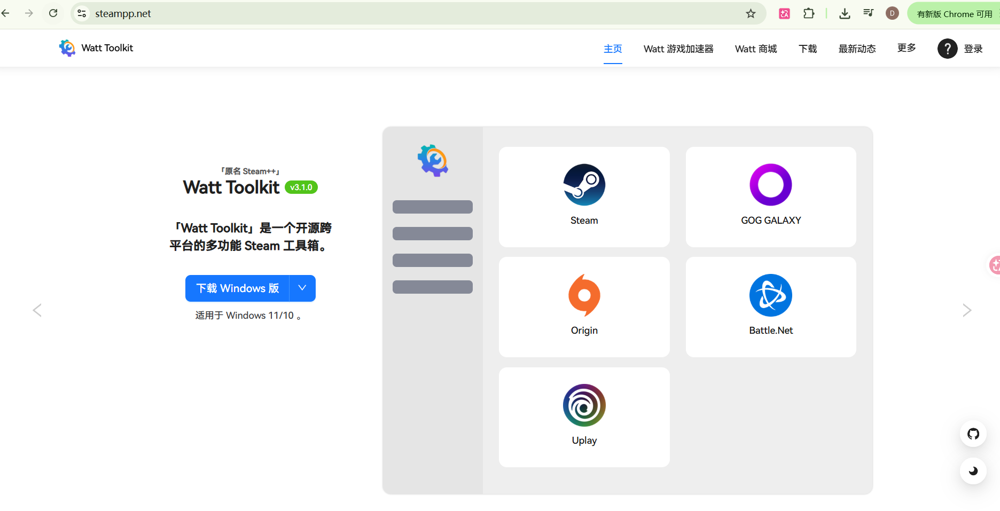

:white_check_mark:哪个能用用哪个

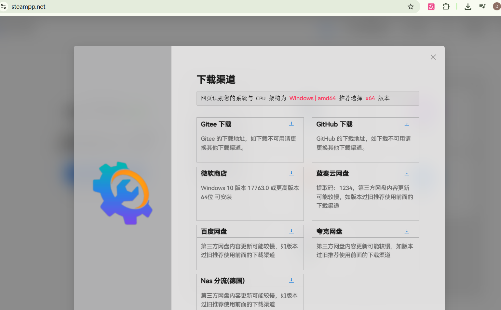

:white_check_mark:双击打开

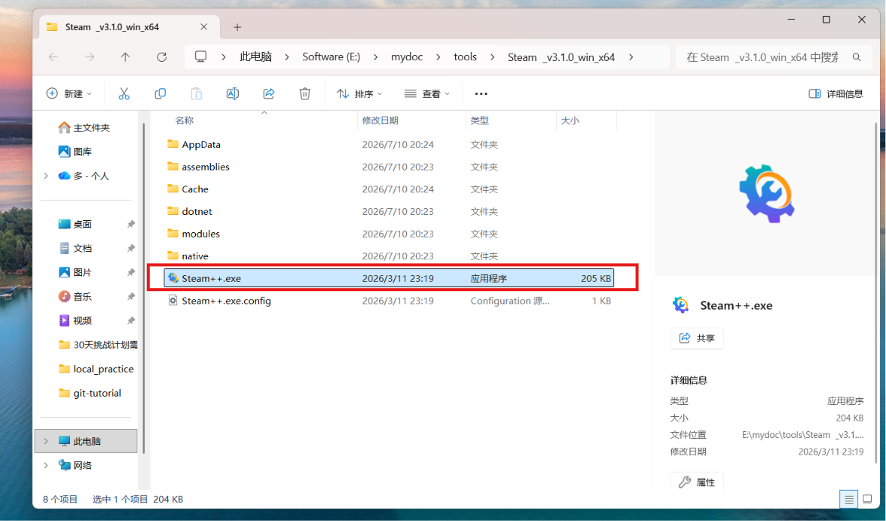

### 1.2 启用加速

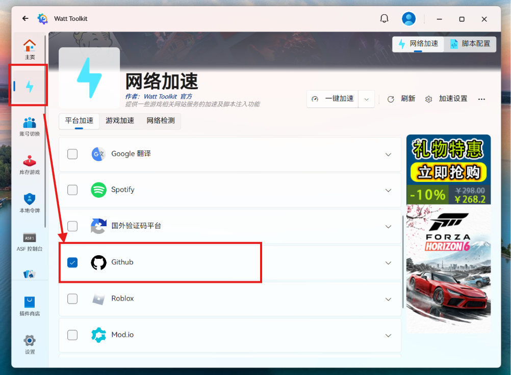

### 2.3 Github冲浪

 :white_check_mark:现在可以无痛打开github了

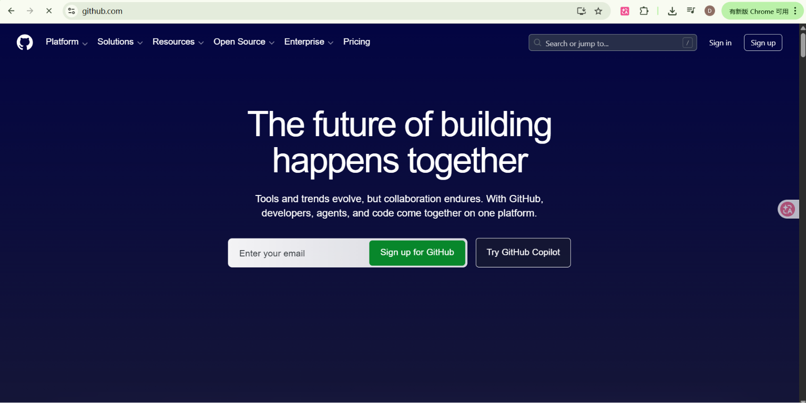

> 这个方法可以顺畅的打开GitHub，想要更快的体验，建议第二种方法

## :airplane: 2 Dev-Sidecar

###  2.1 搜索并下载

:mag: 打开github , 搜索 dev-sidecar

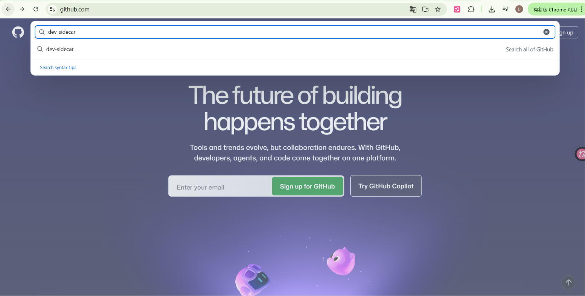

:package: 打开它

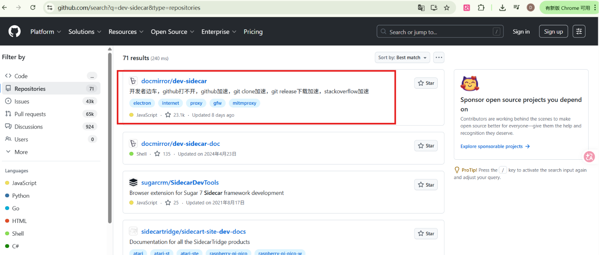

找到release并打开

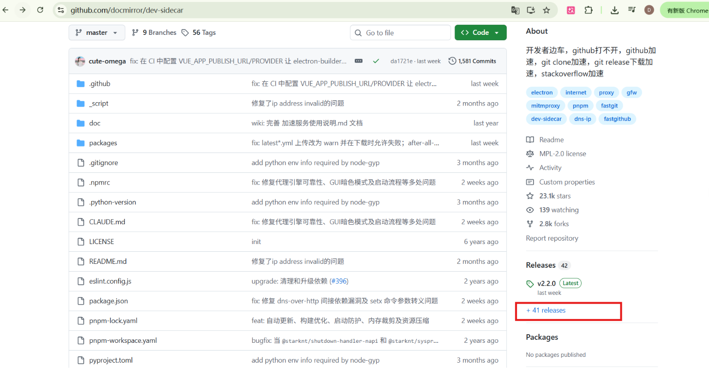

在Asset找到exe文件并把它下载下来

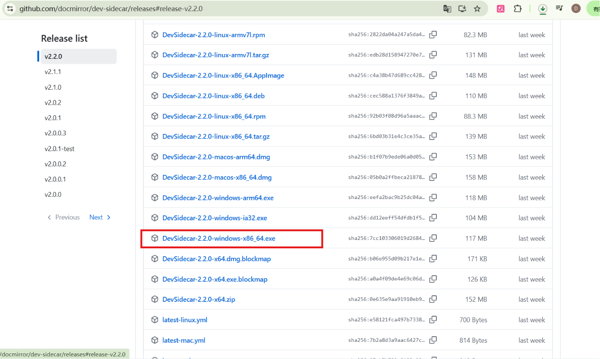

打开安装，一路下一步即可，点击运行

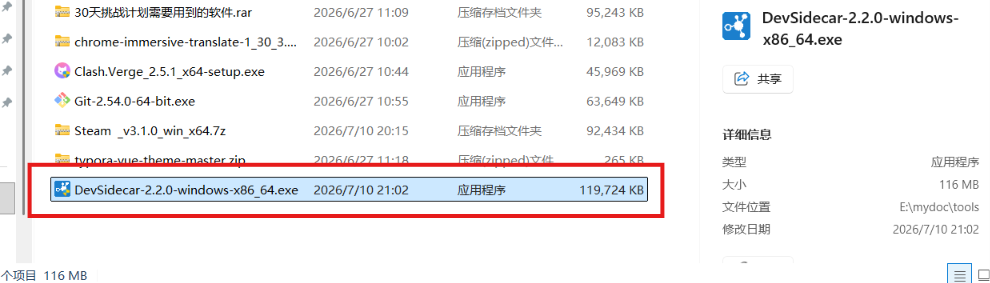

### 2.2 安装根证书

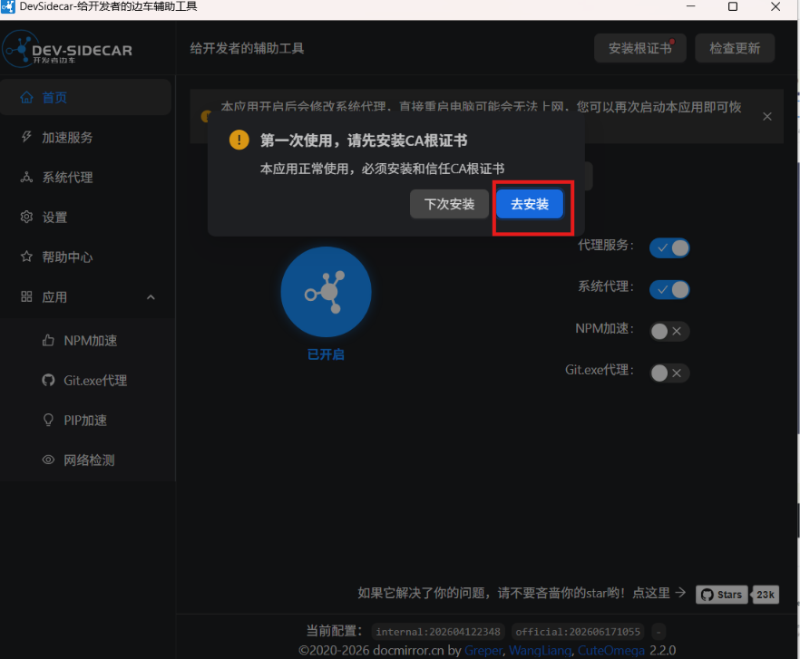

点击去安装，并按照提示安装即可

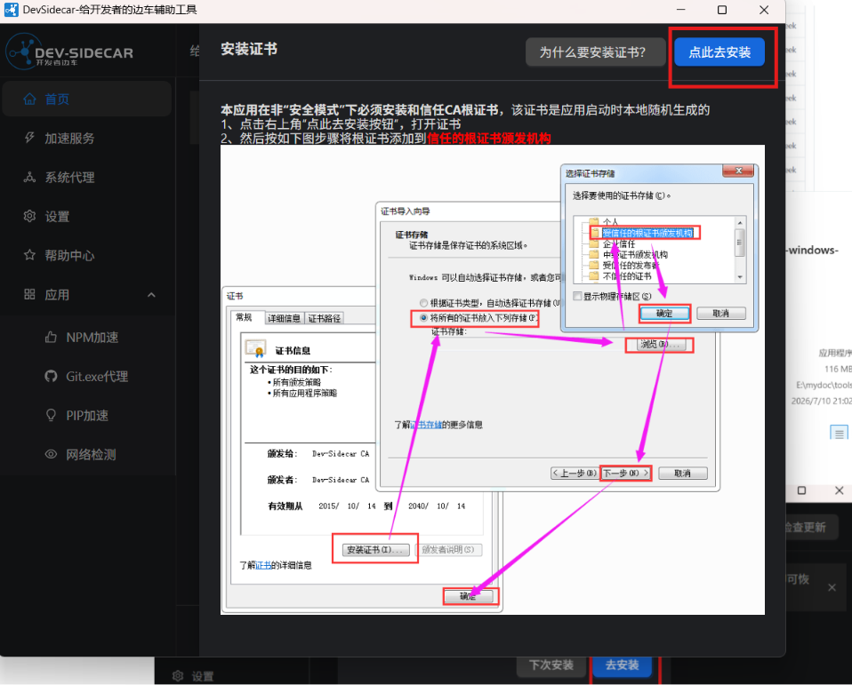

> :o: 注意事项
>
> - 先关代理再关机
> - 先关闭代理再卸载
>
> 本应用开启后会修改系统代理，直接重启电脑可能会无法上网，您可以再次启动本应用即可恢复。如您需要卸载，在卸载前请务必完全退出本应用再进行卸载

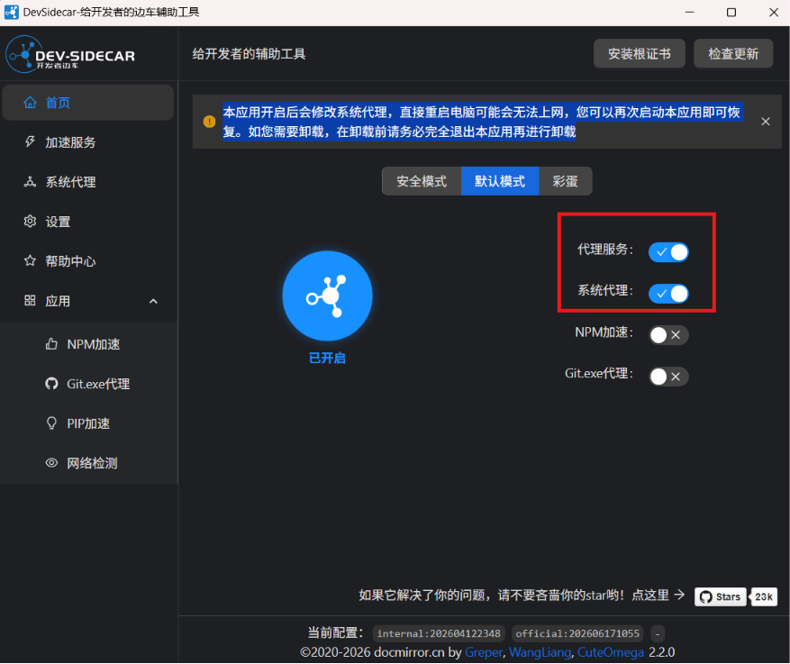

### 2.3 Github冲浪

现在可以在Github里面浪了